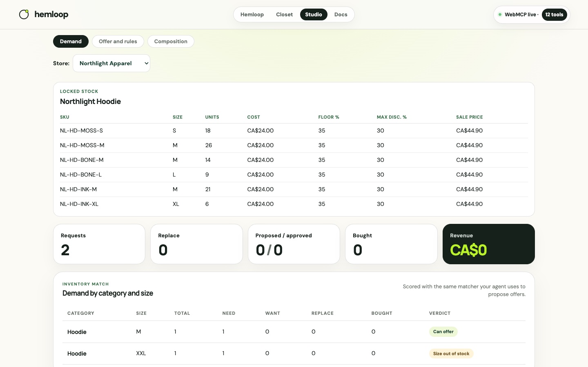

# Hemloop and WebMCP

Both surfaces need tools that operate on **live page state in the user's own session**: the wardrobe
on the shopper's page, the composition on the merchant's. WebMCP registers typed tools in the page
itself — no backend, no OAuth, no credential grant — and the human watches every agent action land
in the UI they are already looking at.

Trust boundaries are **structural**. The closet's only outbound tool cannot include wardrobe rows or
an identifier. The studio has no tool that can touch locked facts. An agent cannot do those things
because the tools do not exist.

## The tool boundary

<svg xmlns="http://www.w3.org/2000/svg" viewBox="0 0 640 300" font-family="DM Sans, system-ui, sans-serif">
  <rect width="640" height="300" fill="#f4f0e6" rx="12"/>
  <rect x="16" y="20" width="200" height="200" rx="14" fill="#fff" stroke="rgba(23,33,28,0.13)"/>
  <text x="116" y="48" text-anchor="middle" fill="#183e30" font-size="13" font-weight="800">Closet · 9 tools</text>
  <text x="116" y="72" text-anchor="middle" fill="#687169" font-size="11">wardrobe · gaps · fit</text>
  <text x="116" y="90" text-anchor="middle" fill="#687169" font-size="11">receipt · preferences</text>
  <text x="116" y="108" text-anchor="middle" fill="#687169" font-size="11">get_offers</text>
  <rect x="40" y="124" width="152" height="36" rx="8" fill="#b9f227"/>
  <text x="116" y="146" text-anchor="middle" fill="#17211c" font-size="11" font-weight="700">report_demand_gap</text>
  <text x="116" y="176" text-anchor="middle" fill="#ee6f4d" font-size="10" font-weight="700">only outbound</text>
  <text x="116" y="198" text-anchor="middle" fill="#687169" font-size="10">human-armed · one-shot</text>

  <path d="M216 142 H280" stroke="#183e30" stroke-width="2.5"/>
  <rect x="280" y="110" width="80" height="64" rx="10" fill="#17211c"/>
  <text x="320" y="138" text-anchor="middle" fill="#b9f227" font-size="11" font-weight="800">bridge</text>
  <text x="320" y="156" text-anchor="middle" fill="#fff" font-size="10">localStorage</text>

  <path d="M360 142 H424" stroke="#183e30" stroke-width="2.5"/>
  <rect x="424" y="20" width="200" height="200" rx="14" fill="#fff" stroke="rgba(23,33,28,0.13)"/>
  <text x="524" y="48" text-anchor="middle" fill="#183e30" font-size="13" font-weight="800">Studio · 12 tools</text>
  <text x="524" y="72" text-anchor="middle" fill="#687169" font-size="11">campaign · scenes</text>
  <text x="524" y="90" text-anchor="middle" fill="#687169" font-size="11">get_demand · propose</text>
  <text x="524" y="108" text-anchor="middle" fill="#687169" font-size="11">validate · export</text>
  <text x="524" y="140" text-anchor="middle" fill="#687169" font-size="11">import_product</text>
  <text x="524" y="168" text-anchor="middle" fill="#ee6f4d" font-size="10" font-weight="700">no lock / unlock tool</text>
  <text x="524" y="190" text-anchor="middle" fill="#ee6f4d" font-size="10" font-weight="700">no approve_offer tool</text>

  <rect x="16" y="236" width="608" height="48" rx="10" fill="#fff" stroke="#ee6f4d" stroke-width="2"/>
  <text x="320" y="258" text-anchor="middle" fill="#ee6f4d" font-size="12" font-weight="800">Never crosses · never exists as a tool</text>
  <text x="320" y="276" text-anchor="middle" fill="#17211c" font-size="11">name · account · wardrobe rows · cost/floor · Approve / Lock / Bought / dial</text>
</svg>

All **21** register together on Hemloop (`/`). `/closet` registers the nine Closet tools; `/studio`
registers the twelve Studio tools.

## The 21 tools

| Surface | Tool | Kind | What it does | Structural guarantee |
|---|---|---|---|---|
| Closet | `get_wardrobe` | read | Compact wardrobe rows on this page | `readOnlyHint`, `untrustedContentHint`; no shopper id |
| Closet | `get_my_sizes` | read | Sizes owned, optional brand filter | `readOnlyHint` |
| Closet | `find_gaps` | read | Missing / thin categories; worn-out by purchase date | `readOnlyHint`; due rows carry date, months, size only |
| Closet | `check_fit` | read | Size advice from owned garments vs catalog | `readOnlyHint` |
| Closet | `get_preferences` | read | Fit, colour, materials, ceiling, brands | `readOnlyHint`; fields only if sharing level allows |
| Closet | `add_garment` | write | Add one local wardrobe row | Enum + bounds; never leaves the page |
| Closet | `report_demand_gap` | write | Only outbound path to a merchant | Needs human approval; one press → one event; no shopper id |
| Closet | `import_receipt` | write | Parse receipt / order email into local purchases | Parsed locally; nothing leaves the page |
| Closet | `get_offers` | read | Approved offers for this closet's own requests | `readOnlyHint`; Bought / Passed is human-only |
| Studio | `get_campaign_state` | read | Facts, lock state, brief, scenes, format | `readOnlyHint` |
| Studio | `set_brief` | write | Creative brief (not rendered copy) | Brief cannot become a claim |
| Studio | `add_scene` / `update_scene` | write | Scene copy | Claim-validated before apply; reject atomically |
| Studio | `reorder_scenes` | write | Timeline order | Permutation-checked |
| Studio | `seek_preview` | write | Preview playhead | Clamped; deterministic |
| Studio | `validate_claims` | read | Dry-run claim validator | Never mutates |
| Studio | `export_composition` | read | Deliver HTML to the page | Refuses while any violation stands |
| Studio | `get_offer` | read | Locked offer (or one approved personal offer) | `readOnlyHint`; human-locked facts only |
| Studio | `import_product` | write | Pull a catalog product into unlocked facts | Refuses while facts are locked |
| Studio | `get_demand` | read | Incoming requests grouped and scored vs stock | `readOnlyHint`, `untrustedContentHint` |
| Studio | `propose_offer` | write | Stage a personal offer inside locked rules | Staged only; Approve is human-only |
| **Both** | **(absent)** | none | No `approve_next_request`, `approve_offer`, `mark_bought`, `lock_facts`, `set_sharing_level` | Those acts are human-only. **This row is the product.** |

## Consent is the dial

The shopper sets a sharing level in the browser. The **next-request preview** on the Closet shows
the real fields that would travel at that level before Approve.

<svg xmlns="http://www.w3.org/2000/svg" viewBox="0 0 640 260" font-family="DM Sans, system-ui, sans-serif">
  <rect width="640" height="260" fill="#f4f0e6" rx="12"/>
  <text x="24" y="28" fill="#687169" font-size="11" font-weight="700" letter-spacing="0.06em">SHARING LEVEL → WHAT LEAVES</text>
  <rect x="24" y="44" width="140" height="72" rx="10" fill="#fff" stroke="rgba(23,33,28,0.13)"/>
  <text x="94" y="68" text-anchor="middle" fill="#17211c" font-size="13" font-weight="800">0 Private</text>
  <text x="94" y="90" text-anchor="middle" fill="#687169" font-size="11">nothing</text>
  <text x="94" y="106" text-anchor="middle" fill="#687169" font-size="11">local only</text>
  <rect x="176" y="44" width="140" height="72" rx="10" fill="#b9f227" stroke="rgba(23,33,28,0.13)"/>
  <text x="246" y="68" text-anchor="middle" fill="#17211c" font-size="13" font-weight="800">1 Basics</text>
  <text x="246" y="90" text-anchor="middle" fill="#17211c" font-size="11">category · size</text>
  <text x="246" y="106" text-anchor="middle" fill="#17211c" font-size="11">need / want</text>
  <rect x="328" y="44" width="140" height="72" rx="10" fill="#fff" stroke="rgba(23,33,28,0.13)"/>
  <text x="398" y="68" text-anchor="middle" fill="#17211c" font-size="13" font-weight="800">2 Context</text>
  <text x="398" y="90" text-anchor="middle" fill="#687169" font-size="11">+ occasion · fit</text>
  <text x="398" y="106" text-anchor="middle" fill="#687169" font-size="11">+ who for</text>
  <rect x="480" y="44" width="140" height="72" rx="10" fill="#fff" stroke="rgba(23,33,28,0.13)"/>
  <text x="550" y="68" text-anchor="middle" fill="#17211c" font-size="13" font-weight="800">3 Taste</text>
  <text x="550" y="90" text-anchor="middle" fill="#687169" font-size="11">+ colour · materials</text>
  <text x="550" y="106" text-anchor="middle" fill="#687169" font-size="11">+ ceiling · pattern</text>
  <rect x="24" y="140" width="596" height="96" rx="12" fill="#fff" stroke="#ee6f4d" stroke-width="2"/>
  <text x="322" y="172" text-anchor="middle" fill="#ee6f4d" font-size="12" font-weight="800">Never at any level</text>
  <text x="322" y="196" text-anchor="middle" fill="#17211c" font-size="12">name · account · email · wardrobe rows · purchase history · income</text>
  <text x="322" y="218" text-anchor="middle" fill="#687169" font-size="11">Preview on the Closet lights the rows that would travel before Approve.</text>
</svg>

## Hosts and browsers

**Supported hosts:** [hemloop.app](https://hemloop.app) and
[hemloop.marcoatwill.workers.dev](https://hemloop.marcoatwill.workers.dev).

**Supported browsers:** ChatGPT's desktop-app built-in browser, or Chrome with
`chrome://flags/#enable-webmcp-testing` (Relaunch, then reopen). The **iOS in-app browser** shows
the page with tools in **preview**.

## Spec hygiene

| Guideline | Hemloop |
|---|---|
| Namespace `document.modelContext` | yes |
| Chrome secure-tools budgets (name, description, output) | asserted across both surfaces |
| `readOnlyHint` / `untrustedContentHint` | yes |
| `additionalProperties: false` | yes |
| Consequential actions need a human step | the gates; no tool can arm them |
