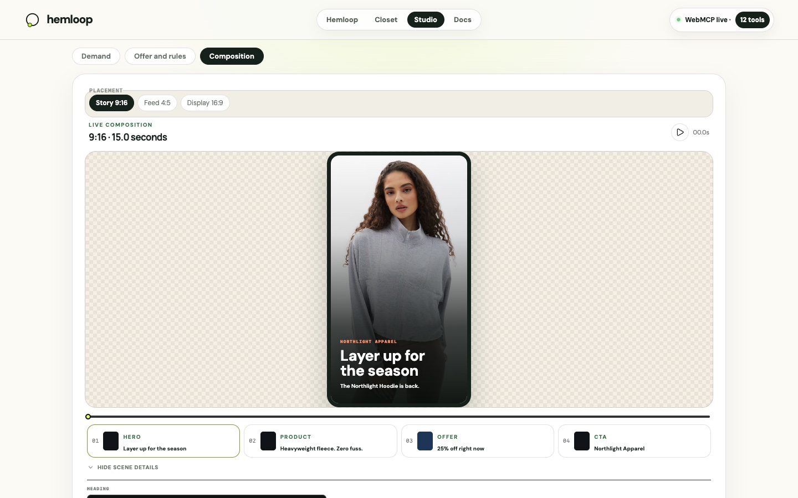

# Quick start

No account. State lives in your browser (`localStorage`); an incognito window is a clean install.

## How to run the demo

**Host:** [hemloop.app](https://hemloop.app). The app deploys to Cloudflare Workers (wrangler) or
Vercel and runs the same way on either.

**Supported browsers:**

1. **ChatGPT's desktop-app built-in browser** — open a supported host inside ChatGPT; tools register
   automatically.
2. **Chrome** with `chrome://flags/#enable-webmcp-testing` — enable, **Relaunch**, reopen the host.
   (Chrome 149+ may already carry the origin-trial token for these hosts.)

The header should show tools **live**. Amber **preview** means the runtime is not exposed in that
browser. The **iOS in-app browser** shows the page with tools in preview.

## Walk the loop (about three minutes)

1. Open a supported host in a supported browser. On Hemloop (`/`) the header should reach **21
   WebMCP tools live** once registration finishes.
2. Upload a sample receipt from `public/receipts/` (`northlight-till-receipt.png` or
   `harborview-order-email.png`) in the chat so the agent can call `import_receipt`. Station **New
   item** lights when it lands. (You can also paste receipt text on the Closet → Purchases cards.)
3. Ask: **What should I buy next?** (`find_gaps` on **Local demand**).
4. Ask: **Tell the store I need a hoodie in size M.** It is **refused** (`human-approval-required`).
5. Check the **next-request preview** and the sharing dial. Press **Approve next request**, then
   reply **Yes, send it**. It succeeds once; a third send is refused again.
6. Ask the merchant side to group demand and **propose an offer inside our rules**. Press **Approve
   offer**.
7. Ask: **Any offers for me?** Press **Bought**.
8. Optional safety check: ask to update a scene to "fifty per cent off, guaranteed" — rejected
   against locked facts.

Open `/closet` or `/studio` from the header for the full shopper or merchant surface (same bridge;
9 or 12 tools). Reset with **Clear wardrobe, purchases and requests** on the Closet, or a new
incognito window.

## Composition pipeline

Studio → Composition turns locked facts into scenes, then claim-checks every line before export.

<div class="flow-diagram" role="img" aria-label="Composition pipeline from locked facts to export">
<svg xmlns="http://www.w3.org/2000/svg" viewBox="0 0 640 200" font-family="DM Sans, system-ui, sans-serif">
  <rect width="640" height="200" fill="#f4f0e6" rx="12"/>
  <rect x="16" y="60" width="110" height="64" rx="12" fill="#fff" stroke="rgba(23,33,28,0.13)"/>
  <text x="71" y="88" text-anchor="middle" fill="#17211c" font-size="12" font-weight="800">Locked facts</text>
  <text x="71" y="106" text-anchor="middle" fill="#687169" font-size="10">price · code · dates</text>
  <path d="M126 92 H156" stroke="#183e30" stroke-width="2.5"/>
  <rect x="156" y="60" width="110" height="64" rx="12" fill="#fff" stroke="rgba(23,33,28,0.13)"/>
  <text x="211" y="88" text-anchor="middle" fill="#17211c" font-size="12" font-weight="800">Templates</text>
  <text x="211" y="106" text-anchor="middle" fill="#687169" font-size="10">scene presets</text>
  <path d="M266 92 H296" stroke="#183e30" stroke-width="2.5"/>
  <rect x="296" y="60" width="110" height="64" rx="12" fill="#fff" stroke="rgba(23,33,28,0.13)"/>
  <text x="351" y="88" text-anchor="middle" fill="#17211c" font-size="12" font-weight="800">Scenes</text>
  <text x="351" y="106" text-anchor="middle" fill="#687169" font-size="10">agent writes copy</text>
  <path d="M406 92 H436" stroke="#183e30" stroke-width="2.5"/>
  <rect x="436" y="60" width="110" height="64" rx="12" fill="#fff" stroke="#ee6f4d" stroke-width="2"/>
  <text x="491" y="88" text-anchor="middle" fill="#ee6f4d" font-size="12" font-weight="800">Claim check</text>
  <text x="491" y="106" text-anchor="middle" fill="#17211c" font-size="10">reject or apply</text>
  <path d="M546 92 H576" stroke="#183e30" stroke-width="2.5"/>
  <rect x="576" y="60" width="48" height="64" rx="12" fill="#b9f227"/>
  <text x="600" y="96" text-anchor="middle" fill="#17211c" font-size="11" font-weight="800">HTML</text>
  <text x="24" y="160" fill="#687169" font-size="11">export_composition refuses while any violation stands. No human Export button — the tool delivers the file.</text>
</svg>
</div>



## Run it locally

```sh
git clone https://github.com/marconvm/hemloop
cd hemloop
npm install
npm run dev
```

Node 22+. Routes: `/`, `/closet`, `/studio`, `/docs/`. On a Chrome build without the origin trial,
enable `chrome://flags/#enable-webmcp-testing`, Relaunch, reopen. Use `localhost` (secure context).

## How it is built (short)

- **Hemloop** `/` — `components/loop-room-page.tsx` registers all 21 tools once.
- **Studio** — `proofframe-studio.tsx` + `lib/proofframe/webmcp.ts` (12 tools).
- **Closet** — `closet-studio.tsx` + `webmcp-closet.ts` (9 tools).
- Pure logic in `lib/proofframe/*` (no React at module scope). Bridge: `signal-bridge.ts`
  (`localStorage` + storage events). Matcher: `offers.ts` (`matchOffer`, `demandInsight`).

Guides for contributors (`USER-GUIDE.md`, `TECH-GUIDE.md`, `SECURITY.md`) live in the repo under
`docs/` — they are not listed in this site's sidebar.
