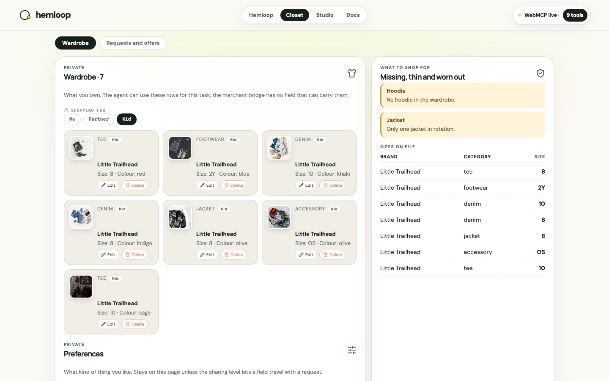

# Shopping for someone else

Maya buys for herself, for her partner, and for her kid. Three wardrobes, three size charts, and a
gift is a different request from a replacement.

The **Me / Partner / Kid** switch on the Closet scopes the wardrobe and every closet tool. `find_gaps`
on the kid's profile finds the kid's gaps; a request from that profile carries the right size.
Kid merchandise photos are flat-lay product stills with no faces.

<svg xmlns="http://www.w3.org/2000/svg" viewBox="0 0 640 170" font-family="DM Sans, system-ui, sans-serif">
  <rect width="640" height="170" fill="#f4f0e6" rx="12"/>
  <rect x="20" y="40" width="70" height="40" rx="8" fill="#b9f227"/>
  <text x="55" y="64" text-anchor="middle" fill="#17211c" font-size="12" font-weight="800">Me</text>
  <rect x="100" y="40" width="70" height="40" rx="8" fill="#fff" stroke="rgba(23,33,28,0.13)"/>
  <text x="135" y="64" text-anchor="middle" fill="#17211c" font-size="12" font-weight="800">Partner</text>
  <rect x="180" y="40" width="70" height="40" rx="8" fill="#fff" stroke="rgba(23,33,28,0.13)"/>
  <text x="215" y="64" text-anchor="middle" fill="#17211c" font-size="12" font-weight="800">Kid</text>
  <path d="M250 60 H300" stroke="#183e30" stroke-width="2"/>
  <rect x="300" y="36" width="140" height="48" rx="10" fill="#fff" stroke="rgba(23,33,28,0.13)"/>
  <text x="370" y="56" text-anchor="middle" fill="#17211c" font-size="12" font-weight="800">Closet tools</text>
  <text x="370" y="72" text-anchor="middle" fill="#687169" font-size="10">scoped wardrobe</text>
  <path d="M440 60 H490" stroke="#183e30" stroke-width="2"/>
  <rect x="490" y="36" width="130" height="48" rx="10" fill="#fff" stroke="#ee6f4d" stroke-width="2"/>
  <text x="555" y="56" text-anchor="middle" fill="#ee6f4d" font-size="11" font-weight="800">Level 2+</text>
  <text x="555" y="72" text-anchor="middle" fill="#17211c" font-size="10">for: kid · gift</text>
  <text x="20" y="120" fill="#687169" font-size="11">Level 1 still sends category · size · need/want only — whose wardrobe never travels.</text>
  <text x="20" y="142" fill="#687169" font-size="11">The next-request preview shows exactly which fields would leave before Approve.</text>
</svg>

## Why this matters for the merchant

A gift buyer and a replacement buyer want different things. Knowing which, without knowing who, is
enough to shape the offer.
