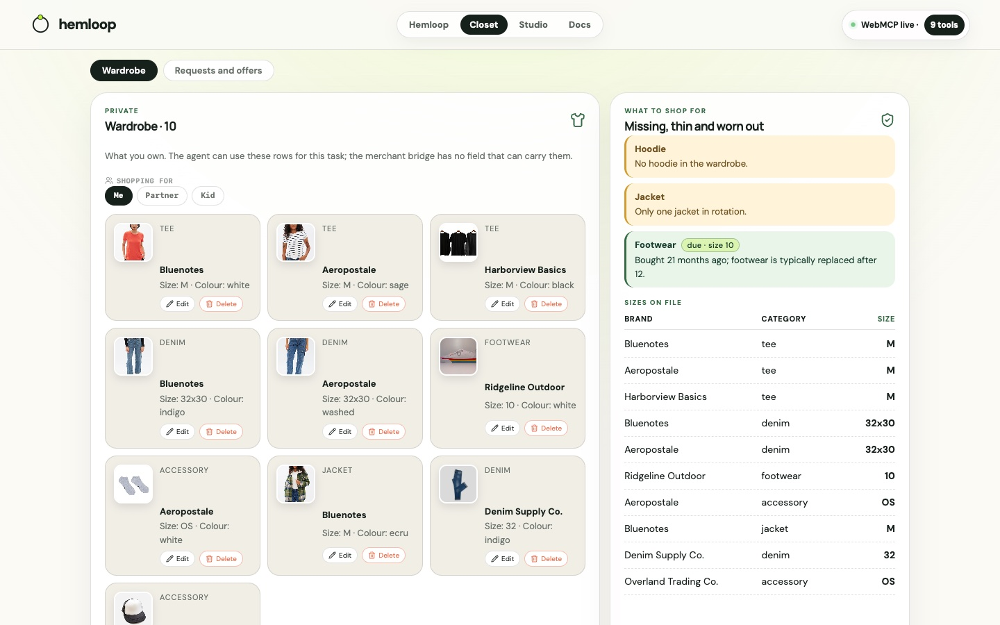

# Right time, not just right product

Maya's closet knows she owns sneakers, so they are not a gap. It also knows she bought them in
November 2024.

Twenty-one months on, `find_gaps` returns footwear with a `due` block: the date, the months elapsed,
and size 10. Her agent reports it with kind `replace`, and the merchant sees demand from someone who
**already owns the thing and wore it out** — timing their own sales data cannot give them.

<svg xmlns="http://www.w3.org/2000/svg" viewBox="0 0 640 160" font-family="DM Sans, system-ui, sans-serif">
  <rect width="640" height="160" fill="#f4f0e6" rx="12"/>
  <rect x="20" y="48" width="120" height="56" rx="10" fill="#fff" stroke="rgba(23,33,28,0.13)"/>
  <text x="80" y="72" text-anchor="middle" fill="#17211c" font-size="12" font-weight="800">Purchase</text>
  <text x="80" y="90" text-anchor="middle" fill="#687169" font-size="10">Nov 2024 · size 10</text>
  <path d="M140 76 H180" stroke="#183e30" stroke-width="2"/>
  <rect x="180" y="48" width="120" height="56" rx="10" fill="#fff" stroke="rgba(23,33,28,0.13)"/>
  <text x="240" y="72" text-anchor="middle" fill="#17211c" font-size="12" font-weight="800">find_gaps</text>
  <text x="240" y="90" text-anchor="middle" fill="#687169" font-size="10">due · 21 months</text>
  <path d="M300 76 H340" stroke="#183e30" stroke-width="2"/>
  <rect x="340" y="48" width="130" height="56" rx="10" fill="#fff" stroke="#ee6f4d" stroke-width="2"/>
  <text x="405" y="72" text-anchor="middle" fill="#ee6f4d" font-size="11" font-weight="800">Approve + send</text>
  <text x="405" y="90" text-anchor="middle" fill="#17211c" font-size="10">kind: replace</text>
  <path d="M470 76 H510" stroke="#183e30" stroke-width="2"/>
  <rect x="510" y="48" width="110" height="56" rx="10" fill="#b9f227"/>
  <text x="565" y="72" text-anchor="middle" fill="#17211c" font-size="12" font-weight="800">Merchant</text>
  <text x="565" y="90" text-anchor="middle" fill="#17211c" font-size="10">“replacing one”</text>
  <text x="20" y="140" fill="#687169" font-size="11">Date, months, size travel. Brand, price, and the purchase row stay in the browser.</text>
</svg>

## What travels

The due row carries the date, the months elapsed and the size to buy again. It does not carry where
she bought them, what she paid, or the brand.

## Tuning

Replacement intervals live in one table (`REPLACEMENT_MONTHS`). A garment with no purchase date is
never called worn out.
