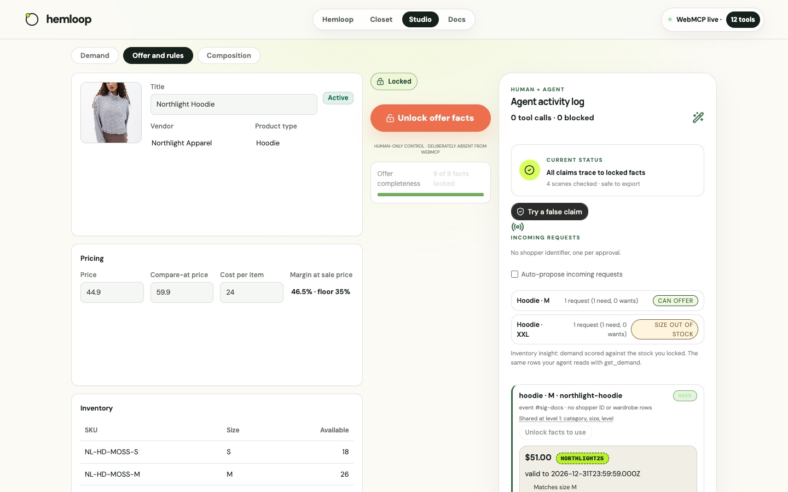

# A receipt from a rival

Maya buys a crew tee from Harborview Basics. She uploads the sample order-email image in chat (or
pastes the text on the Closet). `import_receipt` parses it locally: no OCR on the page, no network.
The purchase joins her log; the tee joins her wardrobe; her **buying pattern** for tees recomputes.

<svg xmlns="http://www.w3.org/2000/svg" viewBox="0 0 640 180" font-family="DM Sans, system-ui, sans-serif">
  <rect width="640" height="180" fill="#f4f0e6" rx="12"/>
  <rect x="20" y="40" width="130" height="56" rx="10" fill="#fff" stroke="rgba(23,33,28,0.13)"/>
  <text x="85" y="64" text-anchor="middle" fill="#17211c" font-size="12" font-weight="800">Rival receipt</text>
  <text x="85" y="82" text-anchor="middle" fill="#687169" font-size="10">image or paste</text>
  <path d="M150 68 H190" stroke="#183e30" stroke-width="2"/>
  <rect x="190" y="40" width="130" height="56" rx="10" fill="#fff" stroke="rgba(23,33,28,0.13)"/>
  <text x="255" y="64" text-anchor="middle" fill="#17211c" font-size="12" font-weight="800">import_receipt</text>
  <text x="255" y="82" text-anchor="middle" fill="#687169" font-size="10">local only</text>
  <path d="M320 68 H360" stroke="#183e30" stroke-width="2"/>
  <rect x="360" y="40" width="120" height="56" rx="10" fill="#b9f227"/>
  <text x="420" y="64" text-anchor="middle" fill="#17211c" font-size="12" font-weight="800">Pattern</text>
  <text x="420" y="82" text-anchor="middle" fill="#17211c" font-size="10">switcher</text>
  <path d="M480 68 H520" stroke="#183e30" stroke-width="2" stroke-dasharray="4 3"/>
  <rect x="520" y="40" width="100" height="56" rx="10" fill="#fff" stroke="#ee6f4d" stroke-width="2"/>
  <text x="570" y="64" text-anchor="middle" fill="#ee6f4d" font-size="11" font-weight="800">Level 3</text>
  <text x="570" y="82" text-anchor="middle" fill="#17211c" font-size="10">pattern only</text>
  <text x="20" y="130" fill="#687169" font-size="11">Purchases, rival name, and prices never leave. At level 3 the matcher may see switcher and offer the max discount inside the floor.</text>
  <text x="20" y="152" fill="#687169" font-size="11">If that discount would break the floor, the offer trims itself until the margin holds.</text>
</svg>

## The pattern shape

| Fact | Values |
|---|---|
| discount sensitivity | `code` / `percent` / `none` |
| spend band | `under-50` / `50-100` / `100-plus` |
| brand loyalty | `loyal` / `switcher` |
